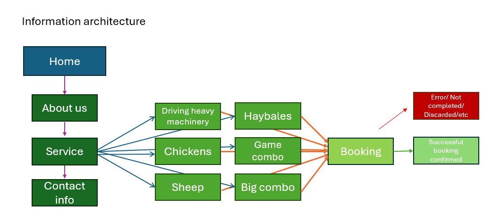

# The Project: A website with a booking system for a small business offering different Farm Experiences (name will be updated once I come up with something clever)

# User Personas
## 1. The admin user

Who?
+ The entrepreneur Ed, 55
Tech Fluency?
+ Okayish, with clear instructions can manage new things too, can get frustrated if things are too difficult

Goals:
+ Marketing and selling their services online
+ Having a booking system online, wants to avoid being on the phone all day everyday
+ Business up and running before summer

Challenges:
+ Has a business idea and the facilities, but no website or social media to promote it or sell the service
+ Doesn't know anything about web development so can't do it on their own
+ The UI must be simple enough for easy use, tech fluency is not super high

Needs:
+ A nice, functional website
+ Can set available time slots for booking on the website
+ A system where the booked resources show up in designated email/calendar

## 2. The customer Claire, 40

Who?
+ The end user booking the services the entrepreneur is offering
Tech Fluency?
+ Can be anything

Goals:
+ Wants to invest in new experiences
+ Wants to surprise friends/family with new experiences

Challenges:
+ Avoids visually unappealing/shady-looking websites
+ A lot of choices

Needs:
+ A professional-looking website
+ Good usability on the website
+ Confirmation after booking

#Use Cases and Usage Scenarios

## 1. Browsing the website

User: Customer
Functionality: 
+ The website is easy to navigate, logical and nice to look at
Outcome: 
+ The user gets the information they came to look for

## 2. Setting bookable dates on the website

User: Admin
Functionality:
+ Choosing the date and time to appear on the website's "Booking" section
+ Publishing the dates
Outcome:
+ A form appears for the admin to fill/choose the dates
+ Confirmation is asked ("Are you sure you want to publish these dates?") before publishing
+ The published dates will appear on the "Booking" section of the website

## 3. Booking

User: Customer
Functionality:
+ Customer browses the available dates on the website
+ Customer chooses the the date they want and book it
Outcome:
+ When a "Book this" is clicked, a form will appear where the customer is to add their contact info
+ Confirmation after successful booking on the browser
+ The booked resource will no longer be available on the website
+ Booking info will be sent to the customers' given email address

## 4. Viewing the booked resources

User: Admin
Functionality:
+ The admin can see the booked resources
Outcome:
+ The booked resources will appear in the admin view, their email/calendar

# UI Prototypes

Right now I am thinking of making a sort of single page website structure for this apart from the booking features, but I will have to see when building it does it work. In Figma (see the link) there are frames for the website, the adding of resources (admin only) and the booking view (customers).

Figma: 

# Information Architecture and Technical Design

The picture above contains the information architecture in a simplified way. 
Home: The default view the user sees when opening the website. From there the content can be accessed either by the navi bar which will stay visible all the time, or by scrolling.
About us: Introduction 
Services: The services/service packs offered to customers with explanations. Under each one will be the possibility to book the resource by clicking a button
Contact info: Ways to contact and location

The 6 service booking choices: Clicking will lead to the booking where the date is chosen and customer contact info given upon booking
Booking: will lead to either successfull booking or in case something goes wrong or the session is discarded an error message is displayed

## Technical Design

Frontend:
+ React for the responsive user interface
+ styling with CSS and SCSS, making sure the responsiveness works across devices
+ possibly Bootstrap
+ forms designing for the admin and booking functionalities with validation

Backend:
+ Node.js with Express for handling the bookings and interactions with database
+ PostgreSQL for the database
+ error handling

API:
+ RESTful API for the communications between client and server

Security:
+ admin-only routes authentication and authorization
+ data validation
+ security headers middleware
+ rate limiting ?

Testing:
+ Unit testing with Jest
+ End-to-end testing to oversee the complete workflow, Cypress
+ Simulating erronous customer behaviour to see if error handling works
+ Apache JMeter for load testing
+ security tests with ZAP

(Scaling: caching with Redis, load balancer for traffic, alerts for performance degregation)

# Project Management and User Testing

The goal of this project is to build a website for booking Farmhouse experiences. It is for a small business owner who is broadening his businesses with this feature. There need to be a booking system he can handle. The project is set to be completed in 7 weeks, of which 5 is remaining now that this planning phase is completed. In total the project is done in four (4) phases. This is a one person sole project, so I am the one responsible of all tasks.

## Phase 1: Definition and Planning
+ user personas and cases
+ UI/UX desing prototype
+ information architecture and tech stack set

## Phase 2: Core Features
+ Database
+ Frontend
+ Backend

## Phase 3: Advanced Features
+ role based features
+ other fine tuning

## Phase 4: User Testing, Final Touches, Launch
+ User testing
+ fixes based on the user testing
+ deploy
+ presentation

## User Testing

1. Objective
The goal of this user testing is to evaluate:

+ Usability of the booking system for both end-users and admin users.
+ Accessibility and responsiveness of the website.
+ Effectiveness of error handling and feedback mechanisms.
+ Overall user experience (UI/UX).

2. Scope
The testing will focus on:

+ Booking functionality (end-user perspective).
+ Admin functionalities (adding resources, viewing booked resources).
+ Navigation and content comprehension (website layout and features).

3. Testing Methodology

+ Task-based Testing: Users will perform specific tasks (e.g., booking a resource, adding availability).
+ Think-Aloud Protocol: Users verbalize their thoughts while completing tasks, providing insight into usability.
+ A/B Testing (Optional): Compare different versions of a feature (e.g., layouts or button placements) if needed.

Roles:

Tester: Users representing end-users and admin users.

Observer: Document user actions, issues, and feedback.

4. Scenarios

Scenario 1: Browsing the Website

Task: Navigate to the "Services" section and find detailed information about a service.

Success Criteria: User easily finds the information they need.

Scenario 2: Booking a Resource (End-User)

Task: Select a date, fill in contact details, and successfully book a resource.

Success Criteria: Booking confirmation is received without errors.

Scenario 3: Adding Availability (Admin)

Task: Add a new available date and verify its appearance in the "Booking" section.

Success Criteria: Date is published accurately.

Scenario 4: Error Handling

Task: Attempt to book an already booked resource.

Success Criteria: The user receives a clear error message.
